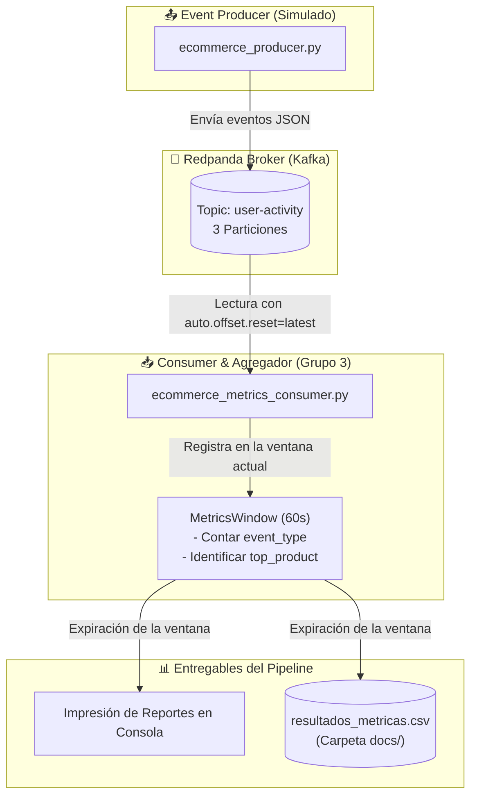

# 📊 Laboratorio de Ingeniería de Datos 2: Pipelines Batch y Streaming (Grupo 3)

Este repositorio contiene la implementación completa de un laboratorio local de ingeniería de datos enfocado en sistemas de recomendación en lotes (batch) y procesamiento de eventos en tiempo real (streaming). Además, incluye de forma detallada la **actividad encargada al Grupo 3** para la analítica de streaming de e-commerce mediante Kafka/Redpanda.

El laboratorio replica arquitecturas comunes en la nube (AWS Glue, Kinesis, RDS, S3, pgvector) de forma 100% local a través de contenedores Docker y Docker Compose.

---

## 🗺️ Arquitectura General del Sistema

El sistema consta de dos flujos de datos principales que operan de forma complementaria:

```text
Ruta de Batch (Lotes):
MySQL (classicmodels + ratings) ──> Job PySpark (ETL) ──> MinIO (Data Lake) ──> Dataset Parquet de Entrenamiento

Ruta de Streaming (Tiempo Real):
Event Producer (Python) ──> Broker Redpanda (Kafka) ──> Stream Processor / Consumer (Grupo 3) ──> Recomendación API <──> PostgreSQL + pgvector
                                                      │
                                                      └──> Reportes en Consola (Ventanas de 1 min) & Exportación CSV
```

### Mapeo de Nube a Local

| Servicio en la Nube (AWS) | Reemplazo Local Usado | Carpeta |
| :--- | :--- | :--- |
| **Amazon RDS MySQL** | Base de Datos MySQL | [`db/`](file:///d:/dico%20local%20D/analitica%20digital/data_engineering_course_lab2-main/db) |
| **AWS Glue / Batch ETL** | PySpark ETL | [`etl/`](file:///d:/dico%20local%20D/analitica%20digital/data_engineering_course_lab2-main/etl) |
| **Amazon S3 Data Lake** | MinIO (Object Storage) | [`min_io/`](file:///d:/dico%20local%20D/analitica%20digital/data_engineering_course_lab2-main/min_io) |
| **RDS PostgreSQL + pgvector** | PostgreSQL con extensión `pgvector` | [`vector_db/`](file:///d:/dico%20local%20D/analitica%20digital/data_engineering_course_lab2-main/vector_db) |
| **Model Inference (Lambda)** | FastAPI Recommendation API | [`recommendation_api/`](file:///d:/dico%20local%20D/analitica%20digital/data_engineering_course_lab2-main/recommendation_api) |
| **Amazon Kinesis / MSK** | Redpanda (Broker compatible con Kafka) | [`streaming_broker/`](file:///d:/dico%20local%20D/analitica%20digital/data_engineering_course_lab2-main/streaming_broker) |
| **Stream Transformation** | Python Stream Processor / Consumer | [`stream_processor/`](file:///d:/dico%20local%20D/analitica%20digital/data_engineering_course_lab2-main/stream_processor) |
| **Simulated Platform Activity**| Python Event Producer | [`event_producer/`](file:///d:/dico%20local%20D/analitica%20digital/data_engineering_course_lab2-main/event_producer) |

---

## 🎯 Actividad Encargada: Pipeline de Streaming del Grupo 3

La actividad principal asignada al **Grupo 3** consistió en implementar un pipeline de procesamiento y analítica en tiempo real para capturar y resumir las métricas clave de comportamiento de los usuarios en una tienda en línea.

### ⚙️ Objetivos y Requerimientos de la Actividad
1. **Consumir Eventos en Tiempo Real**: Conectarse al topic `user-activity` de Redpanda y procesar flujos continuos de eventos JSON (vistas de productos, adiciones al carrito, compras).
2. **Cálculo de Métricas por Ventana Temporal**: Implementar ventanas de tiempo fijas de **1 minuto** (60 segundos) para acumular:
   - Conteo total de eventos por tipo (`product_view`, `add_to_cart`, `purchase`).
   - El código del producto más visto en la ventana (`top_product`).
3. **Persistencia Automática**: Guardar los resultados calculados al final de cada ventana en un archivo estructurado [`resultados_metricas.csv`](file:///d:/dico%20local%20D/analitica%20digital/data_engineering_course_lab2-main/docs/resultados_metricas.csv) ubicado en el directorio `docs/`.
4. **Diseño de Preguntas de Discusión**: Analizar y responder preguntas teóricas sobre arquitectura de streaming (offsets, topics, producers/consumers, tolerancia a fallos, etc.).

---

## 🛠️ Estructura y Componentes de la Actividad del Grupo 3

La lógica de la solución del Grupo 3 se encuentra distribuida en los siguientes archivos clave:

* **[`ecommerce_metrics_consumer.py`](file:///d:/dico%20local%20D/analitica%20digital/data_engineering_course_lab2-main/stream_processor/ecommerce_metrics_consumer.py)**: script de consumo y agregación en ventanas que realiza las métricas descritas, genera logs formateados de consola y guarda los resultados en un CSV.
* **[`run_grupo3_demo.py`](file:///d:/dico%20local%20D/analitica%20digital/data_engineering_course_lab2-main/stream_processor/run_grupo3_demo.py)**: script orquestador de demostración en la raíz que ejecuta simultáneamente en segundo plano tanto el productor de eventos como el consumidor de métricas en modo silencioso (`QUIET_MODE=1`), mostrando únicamente los reportes agregados minuto a minuto.
* **[`grupo3_respuestas.md`](file:///d:/dico%20local%20D/analitica%20digital/data_engineering_course_lab2-main/grupo3_respuestas.md)**: respuestas detalladas a la guía de discusión técnica y tradeoffs de arquitectura (Redpanda vs Apache Kafka, HTTP vs Kafka).

### Diagrama del Flujo de Streaming (Mermaid)



---

## 🚀 Guía de Ejecución

### Requisitos Previos
* Docker y Docker Desktop instalados y activos.
* Python 3.10 o superior.
* Instalar la biblioteca del cliente de Kafka para Python:
  ```bash
  pip install confluent-kafka
  ```

---

### Paso 1: Levantar el Broker Redpanda
Inicie el contenedor de Redpanda y verifique que el topic `user-activity` se haya creado automáticamente:
```bash
cd streaming_broker
docker-compose up -d
```
Verifique el topic ejecutando:
```bash
docker exec -it lab2-redpanda rpk topic list
```
*Debería visualizar el topic `user-activity` con 3 particiones y factor de replicación 1.*

---

### Paso 2: Ejecutar la Demostración Rápida (Recomendado)
Desde la raíz del proyecto, ejecute el script unificado que corre el productor en segundo plano y muestra los resultados agregados del consumidor:
```bash
python stream_processor/run_grupo3_demo.py
```
*Este comando ejecutará el flujo por un periodo de tiempo predefinido (configurable en el script) y reportará las ventanas en vivo directamente en la terminal. Presione `Ctrl+C` para detener la demo en cualquier momento.*

---

### Paso 3: Ejecución Manual en Terminales Separadas
Si desea observar de cerca el flujo detallado de mensajes individuales del productor y del consumidor, abra dos terminales independientes:

* **Terminal 1 (Event Producer)**:
  ```bash
  cd event_producer
  python ecommerce_producer.py
  ```
  *(Genera eventos simulados continuos en formato JSON).*

* **Terminal 2 (Metrics Consumer - Grupo 3)**:
  ```bash
  cd stream_processor
  python ecommerce_metrics_consumer.py
  ```
  *(Consume los eventos, imprime logs individuales en tiempo real y, al finalizar cada minuto, muestra el reporte y actualiza el CSV).*

---

## 📈 Formato de Salida y Resultados

### 1. Salida Esperada en Consola
Al completarse cada minuto, el consumidor imprime un bloque formateado con la siguiente estructura:
```text
==================================================
Window: 17:58-17:59
Total eventos en ventana: 300

  product_view: 210
  add_to_cart: 65
  purchase: 25

top_product: S18_3029

  Top 5 productos (product_view):
    1. S18_3029 — 8 vistas
    2. S10_4698 — 6 vistas
    3. S24_4048 — 5 vistas
    4. S18_1342 — 4 vistas
    5. S700_1691 — 4 vistas
==================================================
```

### 2. Archivo CSV Resultante
Los datos de cada ventana se guardan de forma acumulativa en [`docs/resultados_metricas.csv`](file:///d:/dico%20local%20D/analitica%20digital/data_engineering_course_lab2-main/docs/resultados_metricas.csv) con las siguientes columnas:
* `window_start`: Marca de tiempo de inicio de la ventana.
* `window_end`: Marca de tiempo de finalización.
* `total_events`: Total de eventos procesados en la ventana.
* `product_view`, `add_to_cart`, `purchase`: Cantidades de eventos individuales por tipo.
* `top_product`: Código del producto con más visualizaciones.
* `top_5_products`: Listado serializado del top 5 de productos con sus respectivas frecuencias.

---

## 🧠 Preguntas y Respuestas Técnicas de Discusión

En la entrega del proyecto se incluyeron y respondieron una serie de preguntas teóricas sobre arquitectura de datos. Para ver la respuesta extendida del equipo de trabajo, consulte el documento [`grupo3_respuestas.md`](file:///d:/dico%20local%20D/analitica%20digital/data_engineering_course_lab2-main/grupo3_respuestas.md). A continuación se incluye una síntesis:

1. **¿Qué es un topic?**
   Es un canal con nombre (e.g. `user-activity`) donde los *producers* envían datos y los *consumers* los leen. Se almacena en disco y está particionado para permitir escalabilidad.
2. **¿Cuál es la diferencia entre producer y consumer?**
   El *producer* genera y empuja datos al broker (push) sin saber quién los leerá, mientras que el *consumer* consulta activamente al broker (pull) para procesar los datos de forma independiente y a su propio ritmo.
3. **¿Por qué los sistemas de streaming usan offsets?**
   El *offset* es el identificador numérico incremental de un mensaje dentro de una partición. Sirve para que el consumidor sepa exactamente en qué posición se quedó, permitiendo tolerancia a fallos ante caídas, múltiples consumidores independientes y repetición de datos (replay).
4. **¿Qué pasa si el consumer está fuera de línea unos minutos?**
   Los eventos se guardan de forma duradera en Redpanda gracias a su política de retención en disco (por defecto 1 semana). Al restablecerse el consumer, lee desde el último offset confirmado y procesa la acumulación en ráfaga sin perder ningún dato.
5. **¿Por qué un broker es útil entre la aplicación y el procesador?**
   Actúa como un buffer natural que desacopla temporalmente los sistemas (el receptor no necesita estar online simultáneamente al emisor), amortigua picos de tráfico (backpressure), proporciona durabilidad y permite que el mismo evento sea consumido simultáneamente por diferentes áreas (por ejemplo, métricas, motores de recomendación y sistemas de alertas).
