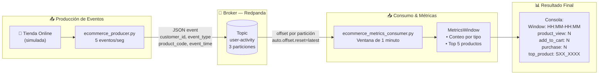

# Grupo 3 — Proyecto Kafka: Stream de Actividad Ecommerce en Tiempo Real

> **Tecnología:** Redpanda (broker compatible con Kafka) · Python · Docker
> **Escenario:** Una tienda online emite eventos cuando los usuarios ven productos, agregan al carrito o compran. El sistema transmite esos eventos y calcula métricas de actividad en vivo.

---

## 1. Diagrama de Diseño del Sistema



### Esquema del Evento

```json
{
  "event_id":    "evt-5c943cef",
  "customer_id": 276,
  "event_type":  "product_view",
  "product_code":"S18_3029",
  "event_time":  "2026-06-15T01:49:36Z"
}
```

---

## 2. Prototipo Local — Descripción

El prototipo implementa el pipeline completo de streaming usando **servicios locales con Docker**, replicando el patrón de arquitecturas cloud (Amazon Kinesis / Kafka en AWS).

### Componentes

| Componente | Tecnología | Rol |
|---|---|---|
| **Broker** | Redpanda v24.3.6 (Docker) | Reemplaza Amazon Kinesis / MSK |
| **Topic** | `user-activity` (3 particiones) | Canal de eventos ecommerce |
| **Producer** | Python + `confluent-kafka` | Genera ~5 eventos/segundo |
| **Consumer** | Python + `confluent-kafka` | Lee y agrega métricas por ventana |

### Archivos del Prototipo

```text
data_engineering_course_lab2-main/
├── streaming_broker/
│   └── docker-compose.yml             ← Redpanda + creación del topic
├── event_producer/
│   └── ecommerce_producer.py          ← Producer standalone (Grupo 3)
├── stream_processor/
│   └── ecommerce_metrics_consumer.py  ← Consumer con ventanas de 1 min
├── run_grupo3_demo.py                 ← Demo: producer + consumer juntos
└── docs/
    └── grupo3_README.md               ← Este documento
```

---

## 3. README — Cómo Ejecutarlo

### Requisitos

- Docker Desktop (corriendo)
- Python 3.10+
- Librería Kafka para Python:

```bash
pip install confluent-kafka
```

### Paso 1 — Levantar el Broker Redpanda

```bash
cd streaming_broker
docker-compose up -d
```

Verificar que el topic fue creado:

```bash
docker exec lab2-redpanda rpk topic list
```

Salida esperada:

```
NAME           PARTITIONS  REPLICAS
user-activity  3           1
```

### Paso 2 — Demo Completo (1 comando)

Desde la raíz del proyecto:

```bash
python run_grupo3_demo.py
```

Lanza producer + consumer durante **130 segundos** y muestra los reportes de ventana directamente en la terminal.

### Paso 3 — Ejecución Manual (2 terminales)

**Terminal 1 — Producer:**

```bash
cd event_producer
python ecommerce_producer.py
```

**Terminal 2 — Consumer con métricas:**

```bash
cd stream_processor
python ecommerce_metrics_consumer.py
```

### Paso 4 — Detener

```bash
cd streaming_broker
docker-compose down
```

### Prueba manual del topic (opcional)

```bash
# Publicar evento de prueba
docker exec -i lab2-redpanda rpk topic produce user-activity <<'EOF'
{"event_id":"evt-001","customer_id":276,"event_type":"product_view","product_code":"S18_3029","event_time":"2026-06-15T17:58:28Z"}
EOF

# Consumir desde el inicio
docker exec lab2-redpanda rpk topic consume user-activity --num 1 --offset start
```

---

## 4. Presentación — Tradeoffs de la Tecnología

### ¿Por qué Kafka / Redpanda?

| Característica | Kafka / Redpanda | HTTP directo / cola simple |
|---|---|---|
| **Durabilidad** | Mensajes en disco; sobreviven caídas | Pérdida si el receptor cae |
| **Desacoplamiento** | Producer y consumer independientes en tiempo y escala | Acoplamiento temporal: ambos deben estar disponibles |
| **Escalabilidad** | Particiones permiten múltiples consumers en paralelo | Cuello de botella en un solo servidor |
| **Replay** | Resetear offset → reprocesar datos históricos | Imposible sin BD adicional |
| **Backpressure** | El broker absorbe picos; consumer procesa a su ritmo | El producer puede saturar al receptor |
| **Múltiples consumers** | N consumers independientes del mismo topic | Fan-out manual |

### Ventajas de Redpanda vs Apache Kafka

| Aspecto | Redpanda | Apache Kafka |
|---|---|---|
| **Dependencias** | Binario único, sin JVM, sin ZooKeeper | Requiere JVM + ZooKeeper / KRaft |
| **Latencia** | Más baja (C++, thread-per-core) | Mayor overhead JVM |
| **API** | 100% compatible con Kafka | — |
| **Dev local** | `docker run` con 512 MB RAM | Más pesado para laptops |

### Cuándo NO usar Kafka

- Apps pequeñas con < 100 req/min → una BD o cola simple basta.
- Cuando se necesita transaccionalidad exactamente-una-vez con bajo volumen.
- Cuando latencia < 1 ms es crítica → ZeroMQ o gRPC directo.

---

## 5. Resultado Final — Salida de Consola Real

Capturado en ejecución real el **2026-06-15** con `python run_grupo3_demo.py`:

```
==================================================
Window: 01:49-01:50
Total eventos en ventana: 125

  product_view: 86
  add_to_cart: 27
  purchase: 12

top_product: S18_2319

  Top 5 productos (product_view):
    1. S18_2319 — 4 vistas
    2. S18_3232 — 4 vistas
    3. S10_4757 — 3 vistas
    4. S10_2016 — 3 vistas
    5. S12_3148 — 3 vistas
==================================================

==================================================
Window: 01:50-01:51
Total eventos en ventana: 299

  product_view: 218
  add_to_cart: 59
  purchase: 22

top_product: S18_1342

  Top 5 productos (product_view):
    1. S18_1342 — 7 vistas
    2. S18_2795 — 6 vistas
    3. S24_2972 — 6 vistas
    4. S10_4698 — 6 vistas
    5. S32_4485 — 6 vistas
==================================================
```

### Interpretación del Resultado

- **product_view domina (~70%):** refleja los pesos `[0.70, 0.20, 0.10]` — comportamiento realista de ecommerce.
- **Ventana 1 (125 eventos):** consumer arrancó a mitad del minuto, capturó ~25 segundos.
- **Ventana 2 (299 eventos):** minuto completo a 5 eventos/seg → ~300 eventos ✅
- **top_product fluctúa:** con distribución uniforme entre 74 productos, empate estadístico esperado por ventana.

---

## 6. Preguntas de Discusión

### ¿Qué es un topic?

Un **topic** es un canal nombrado dentro del broker donde los producers publican mensajes y los consumers los leen.

- Es como una carpeta de correos persistente: `user-activity` recibe todos los eventos de la tienda.
- Se divide en **particiones** para escalar horizontalmente.
- Los mensajes se retienen en disco durante el período de retención (default 1 semana).

```
Topic: user-activity
  Partición 0: [offset 0][offset 1][offset 2]...
  Partición 1: [offset 0][offset 1][offset 2]...
  Partición 2: [offset 0][offset 1][offset 2]...
```

---

### ¿Cuál es la diferencia entre producer y consumer?

| | Producer | Consumer |
|---|---|---|
| **Rol** | Escribe mensajes al topic | Lee mensajes del topic |
| **Dirección** | Push → broker | Pull ← broker |
| **Dependencia** | No sabe quién lee | No sabe quién escribe |
| **En este proyecto** | `ecommerce_producer.py` | `ecommerce_metrics_consumer.py` |

```python
# Producer — empuja datos
producer.produce(topic="user-activity", key="276",
                 value='{"event_type": "product_view", ...}')

# Consumer — jala datos a su ritmo
message = consumer.poll(1.0)
event = json.loads(message.value())
window.record(event)
```

---

### ¿Por qué los sistemas de streaming usan offsets?

Un **offset** es el número de posición de un mensaje dentro de una partición (empieza en 0).

```
Partición 0:
  offset 0 → {"event_type": "product_view", "product_code": "S18_3029"}
  offset 1 → {"event_type": "add_to_cart",  "product_code": "S18_3029"}
  offset 2 → {"event_type": "purchase",      "product_code": "S18_3029"}
                                                              ↑
                                               consumer guardó hasta aquí
```

Beneficios de los offsets:

1. **Retomar tras reinicio** — continúa desde el último offset sin repetir ni perder.
2. **Múltiples consumers independientes** — cada grupo tiene su propio offset.
3. **Replay** — resetear offset al inicio para reprocesar datos históricos.

---

### ¿Qué pasa si el consumer está fuera de línea unos minutos?

Redpanda **retiene los mensajes en disco** durante el período de retención.

```
01:55 — Producer emite 300 eventos/minuto
01:58 — Consumer cae (servidor reiniciado)
02:02 — Consumer vuelve en línea
         ↓
         Lee offset guardado → consume ~1,200 eventos acumulados
         → procesa ventanas 01:58, 01:59, 02:00, 02:01 en ráfaga
```

> Los mensajes **no se pierden**. El consumer simplemente llega tarde y se pone al día.

---

### ¿Por qué el broker es útil entre la aplicación y el procesador?

**Sin broker (acoplado):**
```
Tienda Online ──── HTTP call ───→ Procesador de métricas
```
- ❌ Si el procesador cae → evento perdido
- ❌ Producer debe esperar respuesta (latencia añadida)
- ❌ Picos de tráfico saturan el procesador

**Con broker Redpanda (desacoplado):**
```
Tienda Online → [Topic: user-activity] → Procesador de métricas
                      (Redpanda)
```
- ✅ Producer escribe sin importar si el consumer está disponible
- ✅ Mensajes duraderos en disco
- ✅ Múltiples consumers del mismo topic (métricas + alertas + recomendaciones)
- ✅ Buffer natural ante picos de tráfico
- ✅ Consumer reanuda desde su offset si cae y vuelve
